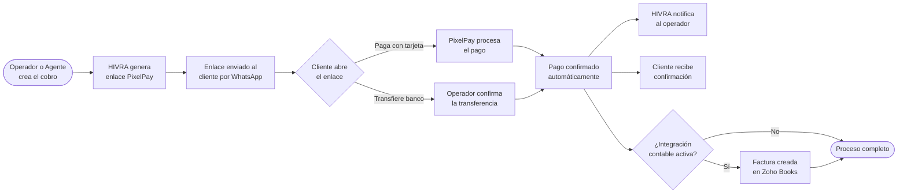

## ¿Cómo funcionan los enlaces de pago?

Los enlaces de pago de HIVRA te permiten cobrar a tus clientes directamente desde WhatsApp, sin que tengan que ir a una tienda en línea, abrir una app separada o hacer una transferencia bancaria. El cliente recibe el enlace en su chat, hace clic, ingresa sus datos de tarjeta en una página segura y listo — el pago queda confirmado en segundos.

## Crear un enlace de pago

### Desde el inbox (durante una conversación)

<Steps>
  <Step title="Abrir la conversación">
    En el inbox, selecciona la conversación del cliente al que quieres cobrar.
  </Step>
  <Step title="Hacer clic en Cobrar">
    En la barra de herramientas inferior del chat, haz clic en el ícono de **💳 Cobrar** o usa el atajo de teclado `Ctrl+P`.
  </Step>
  <Step title="Seleccionar el producto (opcional)">
    Puedes seleccionar un producto de tu catálogo para que el monto y la descripción se completen automáticamente. O bien, ingresa una descripción y monto de forma manual.
  </Step>
  <Step title="Revisar el monto">
    Verifica el monto total, incluyendo ISV si aplica. Si estás aplicando un descuento especial, introdúcelo aquí.
  </Step>
  <Step title="Enviar">
    Haz clic en **Enviar enlace de pago**. El cliente recibirá inmediatamente un mensaje de WhatsApp con el enlace y la descripción del cobro.
  </Step>
</Steps>

### Desde el agente IA (automático)

El agente IA genera y envía enlaces de pago automáticamente cuando un cliente confirma que quiere comprar. No necesitas intervenir — el flujo completo ocurre sin que el operador esté presente.

## Métodos de pago aceptados

| Método | Descripción | Confirmación |
|--------|-------------|--------------|
| **Tarjeta de crédito/débito** | Visa, Mastercard, Amex | Automática (< 5 segundos) |
| **Transferencia bancaria** | El operador confirma manualmente al recibir el comprobante | Manual |
| **Efectivo** | El operador marca el pago como completado | Manual |

<Note>
  Para aceptar pagos con tarjeta, debes tener PixelPay conectado. Ve a **Integraciones → PixelPay** para configurarlo. Si solo aceptas transferencias bancarias, puedes usar los enlaces de cobro como referencia sin necesidad de PixelPay.
</Note>

## Gestionar cobros pendientes

Todos los cobros generados se guardan en **Cobros → Órdenes**. Desde ahí puedes:

- **Ver el estado de cada cobro**: Pendiente, Pagado, Expirado, Cancelado.
- **Reenviar el enlace**: si el cliente perdió el mensaje original.
- **Cancelar un cobro**: para órdenes que ya no son válidas.
- **Marcar como pagado manualmente**: para transferencias o pagos en efectivo que no pasan por PixelPay.

## Expiración de los enlaces

Los enlaces de pago tienen una vigencia de **7 días** por defecto. Si el cliente no paga dentro de ese plazo, el enlace expira automáticamente.

Cuando un enlace está próximo a vencer:
1. HIVRA notifica al operador 24 horas antes.
2. Si el cliente aún no ha pagado, el agente IA puede enviar un recordatorio automático.
3. Si el enlace expira, debes generar uno nuevo desde el inbox.

<Warning>
  No compartas el mismo enlace de pago con múltiples clientes. Cada enlace está vinculado a un cliente y a una transacción específica. Si necesitas cobrar a varias personas por el mismo producto, genera un enlace diferente para cada una.
</Warning>

## Descuentos en cobros

Al generar un enlace de pago, puedes aplicar un descuento:

1. En el formulario de creación del cobro, ingresa el **porcentaje de descuento** (por ejemplo, 10%).
2. El sistema calcula automáticamente el monto con descuento.
3. La descripción del cobro incluirá el descuento aplicado para transparencia del cliente.

<Tip>
  Los descuentos en enlaces de pago NO se sincronizan automáticamente con MindBody como descuentos en el carrito. Si usas MindBody y aplicas un descuento, asegúrate de que el precio en la plataforma refleje lo que cobraste en HIVRA.
</Tip>

## Confirmación de pago

Cuando un cliente completa el pago:

1. El operador recibe una notificación inmediata en el inbox y por correo.
2. El cliente recibe un mensaje de WhatsApp con la confirmación.
3. Si hay integración con MindBody activa, el servicio se inscribe automáticamente en la cuenta del cliente.
4. Si hay integración con Zoho Books activa, se crea la factura y se registra el pago.

<Card title="Ver el flujo de integración con Zoho Books" icon="arrow-right" href="/cobros/zoho-sync">
  Aprende cómo los cobros se sincronizan automáticamente con tu contabilidad.
</Card>
