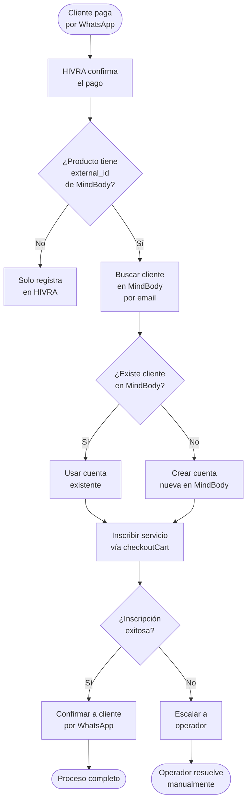

## ¿Qué hace la integración con MindBody?

MindBody es el sistema de gestión más usado por estudios de fitness, yoga, pilates, spas y centros de bienestar. La integración de HIVRA con MindBody cierra el ciclo completo de ventas: cuando un cliente compra un paquete por WhatsApp y paga con su tarjeta, las clases se cargan automáticamente en su cuenta de MindBody en segundos — sin intervención manual.

## Conectar MindBody

<Steps>
  <Step title="Obtener las credenciales de API">
    En tu panel de MindBody, ve a **API Management** y genera un API Key para la integración. Necesitarás:
    - Site ID (el número de tu sitio en MindBody)
    - API Key
    - Staff Credentials (credenciales de un staff con permisos de API)
  </Step>
  <Step title="Ingresar credenciales en HIVRA">
    Ve a **Integraciones → MindBody** y haz clic en **Conectar**. Ingresa tu Site ID, API Key y las credenciales de staff.
  </Step>
  <Step title="Seleccionar la ubicación predeterminada">
    Si tu negocio tiene múltiples locaciones en MindBody, selecciona la ubicación predeterminada. HIVRA intentará detectar la ubicación correcta según el contexto del cliente, pero necesita un valor de respaldo.
  </Step>
  <Step title="Sincronizar catálogo de servicios">
    Haz clic en **Sincronizar servicios**. HIVRA importará todos los servicios y paquetes activos de tu MindBody y los mostrará en tu catálogo de productos. Este proceso toma de 1 a 5 minutos según el tamaño de tu catálogo.
  </Step>
  <Step title="Verificar la conexión">
    HIVRA realizará una llamada de prueba a la API de MindBody. Si ves el mensaje **Conectado** en verde, todo está listo.
  </Step>
</Steps>

## ¿Qué productos se inscriben automáticamente?

Solo los productos que tengan un **external_id de MindBody** asociado se procesan automáticamente. Estos son los servicios que se importaron desde MindBody vía la sincronización del catálogo.

Los productos manuales (creados directamente en HIVRA sin sincronizar desde MindBody) no activan la inscripción automática. Para ese caso, el operador debe inscribir manualmente en MindBody.

## Sincronización de clientes

Cuando un cliente paga un producto de MindBody por primera vez:

1. HIVRA busca en MindBody un cliente con el mismo correo electrónico.
2. Si lo encuentra, usa esa cuenta para la inscripción.
3. Si no lo encuentra, crea una cuenta nueva en MindBody con el nombre y correo del cliente.
4. El `mindbody_client_id` queda guardado en el perfil del cliente en HIVRA para futuras transacciones.

<Note>
  Si el cliente no tiene correo electrónico en HIVRA, no es posible completar la inscripción automática en MindBody (el correo es requerido para crear o buscar el cliente en la plataforma). HIVRA escalará automáticamente la conversación al operador para que complete la inscripción manualmente.
</Note>

## Sincronización de ubicaciones

Si tu estudio tiene múltiples sedes (por ejemplo, San Pedro Sula y Tegucigalpa), HIVRA determina en qué sucursal inscribir al cliente usando esta jerarquía:

1. `location_id` en los metadatos de la orden (si fue especificado en el proceso de venta).
2. Etiqueta de ubicación en el contacto (por ejemplo, `sps` o `tegucigalpa` — detectadas automáticamente por el agente o asignadas por el operador).
3. Ubicaciones asociadas al producto comprado.
4. Ubicación predeterminada del tenant (respaldo).

## Sincronización diaria de ventas

Además del flujo de pago en tiempo real, HIVRA sincroniza diariamente las ventas de los últimos 30 días desde MindBody. Esto captura:

- Ventas hechas directamente en el estudio (walk-in, front desk).
- Compras en la app de MindBody.
- Cualquier venta no procesada a través de HIVRA.

Estos registros aparecen en el **Reporte de sincronización de Zoho** con origen `📋 MindBody` para distinguirlos de los cobros HIVRA.

## Solución de problemas comunes

<AccordionGroup>
  <Accordion title="La inscripción falló — ¿qué hago?" icon="triangle-exclamation">
    Cuando una inscripción falla, HIVRA escala automáticamente la conversación al operador con un mensaje que incluye el motivo del fallo. Los casos más comunes son:

    - El servicio ya no existe en MindBody (fue eliminado o desactivado)
    - El cliente alcanzó el límite de contratos activos
    - La ubicación seleccionada no vende ese servicio

    El operador puede inscribir manualmente en MindBody y luego marcar la orden como completada en HIVRA.
  </Accordion>
  <Accordion title="El token de MindBody expiró" icon="key">
    Los tokens de API de MindBody tienen una duración limitada. HIVRA renueva el token automáticamente, pero si la renovación falla verás un error en la integración. Ve a **Integraciones → MindBody** y haz clic en **Reconectar** para ingresar nuevas credenciales.
  </Accordion>
  <Accordion title="El catálogo de productos no está actualizado" icon="refresh">
    Si agregaste nuevos servicios en MindBody y no aparecen en HIVRA, haz clic en **Sincronizar servicios** desde **Integraciones → MindBody**. La sincronización automática ocurre una vez al día.
  </Accordion>
</AccordionGroup>

<Warning>
  No elimines un servicio de MindBody mientras haya ventas pendientes de procesar en HIVRA. Si el `external_id` del servicio no existe en MindBody, la inscripción automática fallará para esa orden.
</Warning>

<Tip>
  Para probar la integración sin afectar cuentas reales de clientes, crea un contacto de prueba en HIVRA con tu propio correo electrónico y realiza una compra de prueba. Verifica que el servicio aparezca en tu cuenta de MindBody.
</Tip>
