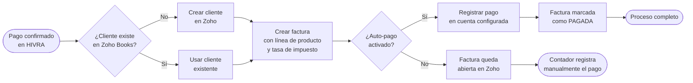

## ¿Qué hace la integración con Zoho Books?

Zoho Books es el sistema de contabilidad y facturación que usan muchos negocios medianos en Honduras. La integración de HIVRA con Zoho Books elimina el trabajo manual de registrar cada venta: cada cobro confirmado en HIVRA genera automáticamente una factura en Zoho Books con el cliente, el servicio, el impuesto y el pago ya registrado.

## Conectar Zoho Books

<Steps>
  <Step title="Preparar tu organización de Zoho Books">
    Antes de conectar, asegúrate de que en tu organización de Zoho Books existan:
    - El impuesto ISV al 15% (si aplica)
    - Las cuentas bancarias o de caja donde se reciben los pagos
  </Step>
  <Step title="Iniciar la conexión en HIVRA">
    Ve a **Integraciones → Zoho Books** y haz clic en **Conectar con Zoho**. Serás redirigido a la página de autorización de Zoho.
  </Step>
  <Step title="Autorizar el acceso">
    Ingresa con tu cuenta de Zoho, selecciona la organización correcta y haz clic en **Aceptar** para otorgar acceso a HIVRA.
  </Step>
  <Step title="Configurar el impuesto">
    De regreso en HIVRA, selecciona el impuesto que corresponde a tus ventas. En Honduras, generalmente es el **ISV 15%**. Si no tienes un impuesto creado, primero créalo en Zoho Books.
  </Step>
  <Step title="Configurar el mapa de cuentas de pago">
    Define en qué cuenta contable se registra cada método de pago:
    - **PixelPay** → Cuenta PixelPay o Cuentas por cobrar tarjetas
    - **Transferencia bancaria** → Tu cuenta bancaria corriente
    - **Otro** → Caja chica
  </Step>
  <Step title="Configurar el auto-pago">
    Decide si Zoho Books debe marcar la factura como pagada automáticamente cuando HIVRA confirma el cobro. Si lo activas, el ciclo completo es automático. Si no lo activas, el contador debe registrar manualmente el pago en Zoho.
  </Step>
</Steps>

## ¿Qué información va a Zoho Books?

Por cada venta sincronizada, HIVRA envía a Zoho Books:

| Campo en Zoho | Origen en HIVRA |
|---------------|-----------------|
| Cliente | Nombre y email del contacto en HIVRA |
| Fecha de factura | Fecha en que se confirmó el pago |
| Producto/Servicio | Nombre del producto vendido |
| Precio unitario | Monto cobrado (sin impuesto) |
| Impuesto | ISV 15% (si está configurado) |
| Notas de la factura | Número de orden HIVRA + sucursal + método de pago |
| Pago | Monto total + cuenta contable según método |

## Sincronización de ventas MindBody

Además de los cobros realizados directamente en HIVRA, el sistema también sincroniza las ventas registradas en MindBody (walk-ins, ventas en el estudio, compras en la app de MindBody) a través de la sincronización nocturna.

Estas ventas aparecen en el **Reporte de sincronización** con origen `📋 MindBody` y pueden ser empujadas a Zoho Books de forma individual o en lote desde ese reporte.

<Note>
  La sincronización de ventas MindBody → Zoho Books es diferente de la sincronización en tiempo real de pagos HIVRA → Zoho. Las primeras tienen un ciclo diario; las segundas son inmediatas.
</Note>

## Manejo de impuestos en Zoho

HIVRA soporta dos modalidades de impuesto en Zoho Books:

| Modalidad | Descripción | Cuándo usar |
|-----------|-------------|-------------|
| **Impuesto exclusivo** | El 15% se agrega sobre el precio base | Cuando el precio mostrado al cliente no incluye impuesto |
| **Impuesto inclusivo** | El 15% ya está incluido en el precio | Cuando el precio mostrado al cliente incluye impuesto |

La modalidad se configura en **Integraciones → Zoho Books → Configuración de impuesto**. Asegúrate de que coincide con cómo declaras el ISV ante el SAR.

## Sucursales y ramas contables

Si tu negocio tiene múltiples sucursales, puedes mapear cada ubicación de MindBody a una rama (branch) o departamento en Zoho Books:

1. Ve a **Integraciones → Zoho Books → Mapa de sucursales**.
2. Para cada ubicación de MindBody (por número de Location ID), asigna el nombre de la rama en Zoho Books.
3. Las facturas generadas para esa ubicación quedarán clasificadas en esa rama.

## Reconectar Zoho Books

Los tokens de OAuth de Zoho tienen una vigencia de 1 hora (renovable automáticamente) y un refresh token de 60 días. Si la conexión expira:

1. Ve a **Integraciones → Zoho Books**.
2. Haz clic en **Reconectar**.
3. Autoriza nuevamente en la página de Zoho.

<Warning>
  Si cambias la contraseña de tu cuenta de Zoho, la integración puede desconectarse. Reconecta desde **Integraciones → Zoho Books** si notas que las facturas ya no se están creando.
</Warning>

<Tip>
  Pide a tu contador que revise periódicamente las facturas creadas desde HIVRA en Zoho Books. La primera semana de uso es un buen momento para verificar que los montos, impuestos y cuentas son correctos antes de que se acumulen muchos registros.
</Tip>
