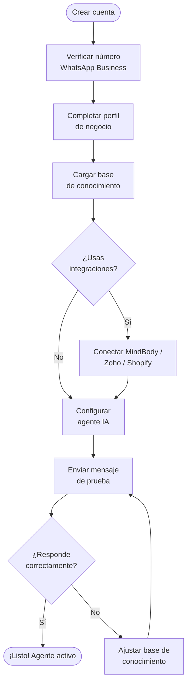

## Proceso de configuración

Desde que creas tu cuenta hasta que el agente IA comienza a atender tus clientes, el proceso toma aproximadamente 20 a 30 minutos. Sigue los pasos en orden para asegurarte de que todo funcione correctamente.

## Paso 1: Crear tu cuenta

<Steps>
  <Step title="Acceder al registro">
    Ve a [app.hivra.ai](https://app.hivra.ai) y haz clic en **Crear cuenta**. Ingresa tu correo electrónico y crea una contraseña segura.
  </Step>
  <Step title="Verificar tu correo">
    Recibirás un correo de verificación en los próximos 2 minutos. Haz clic en el enlace para activar tu cuenta. Revisa la carpeta de spam si no lo ves en tu bandeja de entrada.
  </Step>
  <Step title="Seleccionar tu plan">
    Durante el onboarding podrás escoger entre los planes disponibles. Todos incluyen un período de prueba gratuito de 14 días. Puedes cambiarlo más adelante desde **Configuración → Planes**.
  </Step>
</Steps>

<Note>
  Si tu negocio tiene múltiples operadores (por ejemplo, un equipo de ventas), puedes invitar a tu equipo desde **Configuración → Equipo** una vez que tu cuenta esté activa.
</Note>

## Paso 2: Conectar WhatsApp Business

<Steps>
  <Step title="Acceder a la configuración de WhatsApp">
    En el dashboard, ve a **Configuración → WhatsApp**. Verás las opciones de conexión disponibles.
  </Step>
  <Step title="Escanear el código QR">
    Abre WhatsApp Business en tu teléfono. Ve a **Dispositivos vinculados → Vincular dispositivo** y escanea el código QR que aparece en pantalla.
  </Step>
  <Step title="Confirmar la conexión">
    En unos segundos verás el estado cambiar a **Conectado** junto con el nombre de tu número. A partir de este momento, HIVRA puede enviar y recibir mensajes desde ese número.
  </Step>
</Steps>

<Warning>
  El número de WhatsApp que vincules debe ser exclusivo para HIVRA. Si lo usas simultáneamente en otro dispositivo o en WhatsApp Web, la conexión puede interrumpirse.
</Warning>

## Paso 3: Completar tu perfil de negocio

Tu agente IA usa el perfil de negocio para responder preguntas sobre tu empresa. Cuantos más detalles proporciones, mejores serán sus respuestas.

<Steps>
  <Step title="Información básica">
    Ve a **Configuración → Perfil de negocio** y completa:
    - Nombre del negocio
    - Sector o vertical (fitness, spa, retail, etc.)
    - Dirección física (opcional)
    - Horarios de atención
    - Moneda principal (Lempiras / Dólares)
  </Step>
  <Step title="Presentación del agente">
    Define cómo se presentará el agente IA a tus clientes:
    - Nombre del agente (por ejemplo, "Sofía de MOUV Studio")
    - Tono de comunicación (formal, casual, amigable)
    - Idioma principal (Español)
  </Step>
  <Step title="Información de contacto">
    Agrega los medios de contacto alternativos que el agente puede compartir con los clientes: correo, teléfono de emergencias, redes sociales.
  </Step>
</Steps>

## Paso 4: Cargar la base de conocimiento

La base de conocimiento es el "cerebro" de tu agente IA. Aquí defines los productos, servicios, precios y respuestas a preguntas frecuentes.

<Steps>
  <Step title="Agregar productos y servicios">
    Ve a **Ajustes → Conocimiento → Productos**. Agrega cada producto o servicio con su nombre, descripción, precio y cualquier condición especial.
  </Step>
  <Step title="Preguntas frecuentes">
    En la sección **FAQ**, escribe las preguntas que tus clientes hacen con más frecuencia y las respuestas correctas. Por ejemplo: "¿Tienen estacionamiento?", "¿Aceptan pagos con tarjeta?".
  </Step>
  <Step title="Políticas del negocio">
    Agrega tus políticas de cancelación, reembolso, membresías o cualquier regla importante que el agente deba comunicar correctamente.
  </Step>
</Steps>

<Tip>
  Cuanto más específica sea tu base de conocimiento, menos veces el agente tendrá que escalar conversaciones al operador. Dedica tiempo a este paso — vale la pena.
</Tip>

## Paso 5: Conectar integraciones (opcional)

Si usas sistemas externos como MindBody, Zoho Books o Shopify, este es el momento de conectarlos. Cada integración tiene su propia guía detallada:

<CardGroup cols={2}>
  <Card title="MindBody" icon="dumbbell" href="/integraciones/mindbody">
    Para estudios de fitness, yoga, pilates y bienestar.
  </Card>
  <Card title="Zoho Books" icon="file-invoice" href="/integraciones/zoho-books">
    Para facturación electrónica y contabilidad automática.
  </Card>
  <Card title="Shopify" icon="shopping-cart" href="/integraciones/shopify">
    Para tiendas de retail y e-commerce.
  </Card>
  <Card title="Google Calendar" icon="calendar" href="/integraciones/google-calendar">
    Para agendar citas y gestionar disponibilidad.
  </Card>
</CardGroup>

## Paso 6: Enviar mensaje de prueba

Antes de activar el agente para todos tus clientes, es buena práctica probarlo internamente:

<Steps>
  <Step title="Enviar un mensaje de prueba">
    Desde un teléfono diferente, envía un mensaje a tu número de WhatsApp Business como si fueras un cliente nuevo. Por ejemplo: "Hola, quisiera información sobre sus servicios."
  </Step>
  <Step title="Verificar la respuesta">
    El agente debería responder en menos de 5 segundos. Verifica que la información sea correcta y el tono sea el adecuado para tu marca.
  </Step>
  <Step title="Ajustar si es necesario">
    Si la respuesta no es la esperada, ve a **Conocimiento** y ajusta la información relevante. Repite la prueba hasta que estés satisfecho.
  </Step>
</Steps>

## ¡Tu agente está listo!

Una vez completados estos pasos, tu agente IA comenzará a atender todos los mensajes entrantes automáticamente. Puedes monitorear las conversaciones en tiempo real desde el **Inbox** del dashboard.

<Card title="Explorar el Inbox" icon="inbox" href="/whatsapp/inbox">
  Aprende a gestionar conversaciones, revisar el historial de clientes y escalar casos al equipo humano.
</Card>
