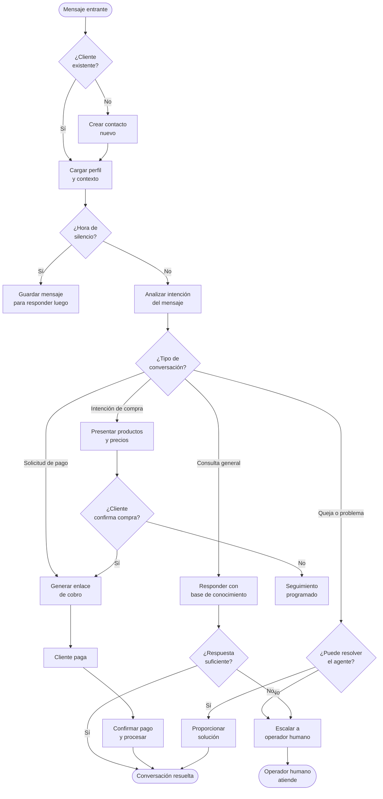

## ¿Cómo funciona el agente IA?

El agente IA de HIVRA es un asistente conversacional que actúa como el primer punto de contacto para todos los mensajes que llegan a tu WhatsApp Business. Analiza cada mensaje, consulta tu base de conocimiento y decide la mejor respuesta o acción a tomar — todo en menos de 3 segundos.

El agente sigue un flujo de decisiones estructurado para cada conversación:

## Flujo de decisiones del agente

### 1. Identificación del cliente

Cuando llega un mensaje nuevo, el agente primero identifica si el número de WhatsApp corresponde a un contacto existente en tu base de datos. Si es un cliente nuevo, crea automáticamente un perfil con el número de teléfono y el nombre que aparece en WhatsApp.

### 2. Análisis de la intención

El agente analiza el contenido del mensaje para determinar la intención del cliente. Las categorías principales son:

| Intención | Ejemplo | Acción del agente |
|-----------|---------|-------------------|
| Consulta informativa | "¿Cuánto cuesta el paquete de 10 clases?" | Responde con precios de la base de conocimiento |
| Intención de compra | "Quiero comprar el paquete mensual" | Presenta opciones y genera enlace de pago |
| Agendamiento | "¿Puedo reservar una clase para el martes?" | Verifica disponibilidad y coordina reserva |
| Queja o problema | "Mi pago no procesó" | Intenta resolver; escala si no puede |
| Consulta fuera de alcance | Preguntas que no están en KB | Escala al operador con contexto |

### 3. Construcción de la respuesta

El agente construye su respuesta basándose en:
- Tu **base de conocimiento** (productos, servicios, FAQs, políticas)
- El **historial de la conversación** (contexto de los últimos mensajes)
- El **perfil del cliente** (si es cliente existente, sus preferencias y compras)
- Las **instrucciones del agente** que configuraste en los ajustes

### 4. Decisión de escalamiento

El agente escala automáticamente la conversación al operador humano cuando:
- El cliente solicita explícitamente hablar con una persona
- La pregunta no tiene respuesta en la base de conocimiento
- Hay un problema de pago que requiere intervención manual
- El cliente expresa frustración o insatisfacción repetida
- Se detecta una situación urgente o fuera de lo ordinario

## Pasos del agente IA

El agente sigue una secuencia de pasos para manejar cada conversación. Puedes ver en qué paso está desde el panel de la conversación:

**PASO A — Calificación inicial**: El agente saluda, identifica la necesidad del cliente y determina si tiene lo que busca.

**PASO B — Presentación y cotización**: Presenta los productos o servicios relevantes con precios. Responde preguntas específicas sobre disponibilidad o condiciones.

**PASO C — Gestión del cobro**: Genera el enlace de pago y hace seguimiento. Si el cliente dice que pagará más tarde, programa un recordatorio automático.

**PASO D — Confirmación post-pago**: Una vez confirmado el pago, envía la confirmación y las instrucciones pertinentes (acceso al servicio, próximos pasos, etc.).

## Personalizar el comportamiento del agente

Desde **Configuración → Agente** puedes ajustar cómo se comporta tu asistente:

<AccordionGroup>
  <Accordion title="Nombre y personalidad" icon="user">
    Define el nombre con el que el agente se presentará a los clientes y el tono de sus mensajes. Puedes elegir entre formal, casual o amigable según la cultura de tu negocio.
  </Accordion>
  <Accordion title="Instrucciones especiales" icon="list">
    Agrega instrucciones específicas que el agente debe seguir en todo momento. Por ejemplo: "Siempre mencionar que tenemos estacionamiento gratuito" o "No dar precios sin antes preguntar qué servicio busca el cliente."
  </Accordion>
  <Accordion title="Umbral de escalamiento" icon="arrow-up">
    Configura qué tan rápido el agente escala al operador. Un umbral bajo significa que escala ante cualquier duda; un umbral alto significa que intenta resolver más situaciones por su cuenta.
  </Accordion>
  <Accordion title="Seguimiento automático" icon="clock">
    Define cada cuánto tiempo el agente hace seguimiento a conversaciones sin respuesta. El valor predeterminado es 24 horas para la primera, y 48 horas para la segunda.
  </Accordion>
</AccordionGroup>

## Pausar el agente en una conversación

En cualquier momento puedes pausar el agente para una conversación específica y responder manualmente:

1. Abre la conversación en el inbox.
2. Haz clic en el ícono **⏸ Pausar agente** en la barra superior.
3. Responde manualmente las veces que necesites.
4. Cuando termines, haz clic en **▶ Reactivar agente** para devolver el control al sistema.

<Warning>
  Si pausas el agente y olvidas reactivarlo, la conversación quedará esperando indefinidamente. Configura notificaciones para conversaciones inactivas para evitar que clientes se queden sin respuesta.
</Warning>

## Monitorear el rendimiento del agente

Revisa cómo está funcionando tu agente desde **Reportes → Rendimiento del agente**:

- **Tasa de resolución**: porcentaje de conversaciones resueltas sin intervención humana.
- **Tiempo de respuesta promedio**: cuánto tarda el agente en responder desde que llega un mensaje.
- **Tasa de escalamiento**: porcentaje de conversaciones que el agente escaló al operador.
- **Conversiones**: cuántas conversaciones terminaron en una venta o pago.

<Tip>
  Una tasa de escalamiento mayor al 30% es señal de que tu base de conocimiento necesita más contenido. Revisa qué preguntas escaló el agente la última semana y agrégalas a los FAQs.
</Tip>
